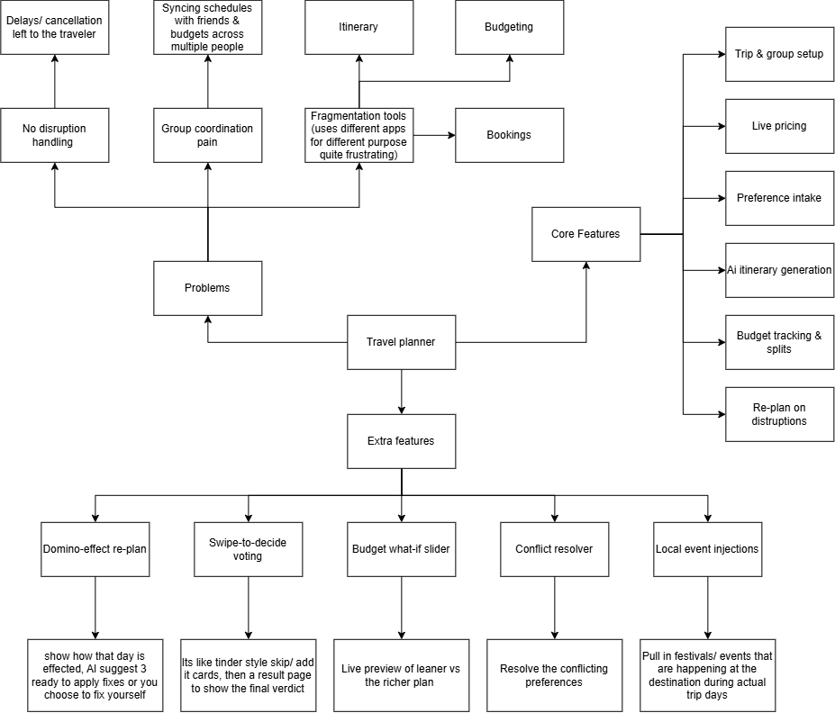
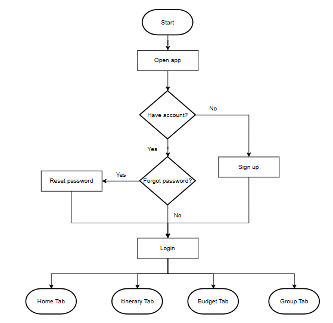
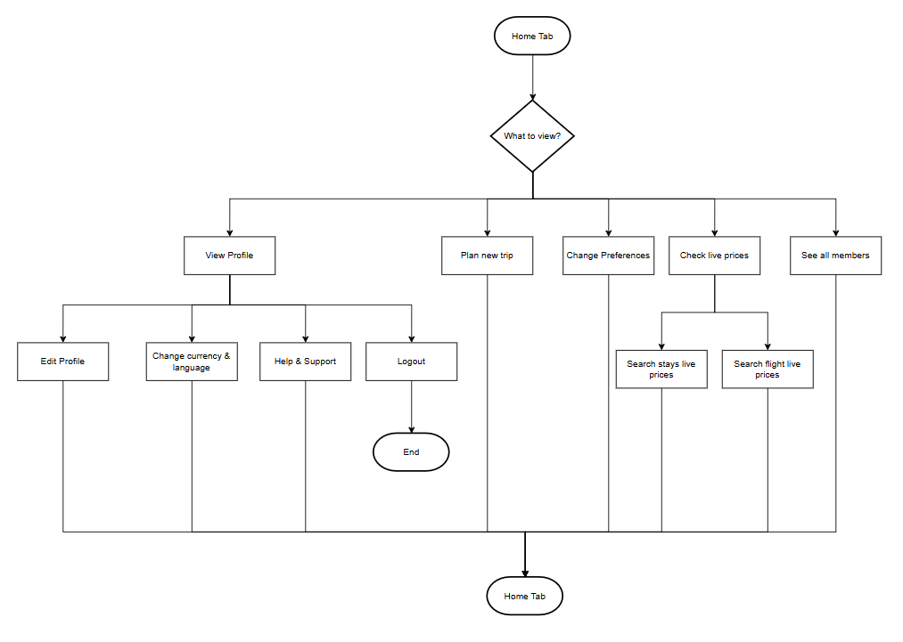
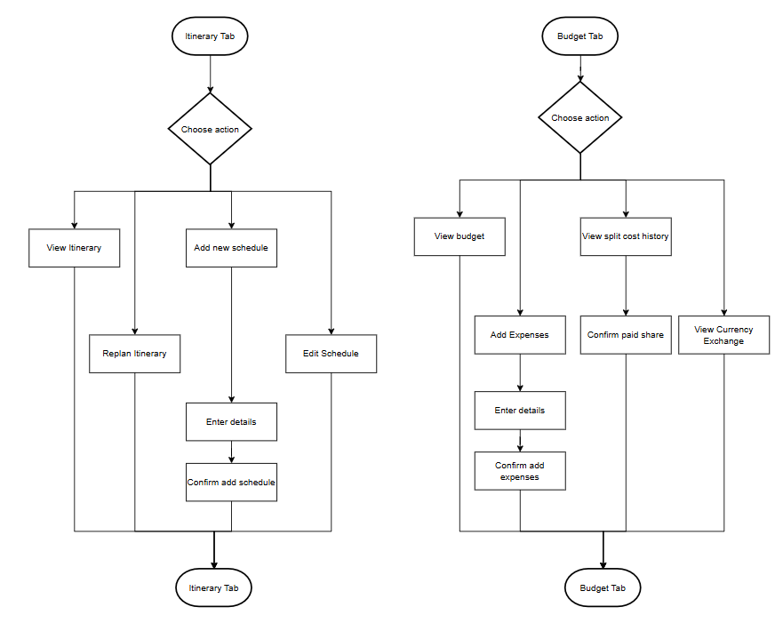
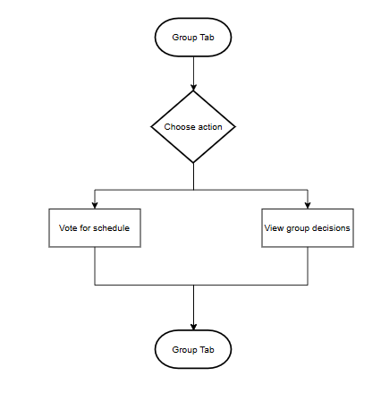
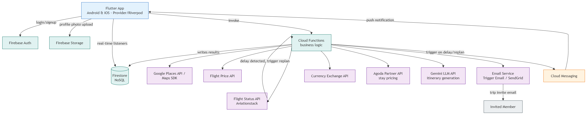

# Bon Voyage by Two of a Kind

**Team:** Kwok Ting Hui, See Yi Xi

**Problem Statement:** Travel Planner

**Video Presentation:** https://youtu.be/xlr_X5aC51s?si=Snq2jn3-QJ-yfxif

**Presentation Slides:** https://canva.link/f2bqg0u58z8otdc

## 1. Project Overview

### The Problem

**The problem and root causes**
Planning a trip currently means juggling logistics, budgets, and conflicting group preferences across fragmented channels, leaving travelers overwhelmed before their journey even begins. The core issue is app fragmentation — users are forced to alternate between several single-purpose platforms for flight bookings, accommodation, and expense tracking. This disconnect makes manual itinerary assembly tedious and creates severe decision fatigue when trying to align individual budgets, schedules, and interest profiles. Existing travel tools also operate as static digital notebooks — they fail to provide real-time, automated replanning when disruptions like delayed flights, bad weather, or sudden venue closures occur mid-trip.

**Key stakeholders**
This problem directly impacts two primary user groups: group trip coordinators and solo travelers. Group coordinators and companions need a centralized space to align preferences, split shared costs transparently, and organize itineraries without endless back-and-forth messaging. Solo travelers need an efficient, end-to-end trip creation tool that removes the friction of manual planning and live re-routing. Secondary stakeholders include travel and hospitality providers — airlines, hotel networks, and local activity hosts — whose live booking and availability APIs power dynamic, real-time schedule updates.

**Existing market solutions and shortfalls**
Major travel platforms focus almost entirely on booking transactions rather than holistic trip management. Online travel agencies like [Trip.com](http://trip.com) excel at consolidated bookings for flights, trains, and hotels, but offer no collaborative tools for groups to align preferences or build shared daily itineraries — leaving users to rely on external spreadsheets. Agoda provides competitive accommodation and flight deals but operates purely as a point-of-sale platform; it doesn't help with day-to-day schedule creation, expense splitting, or dynamic itinerary re-routing when disruptions occur.

### Our Solution

An adaptive travel planning ecosystem that eliminates app fragmentation by unifying group setup, AI itinerary generation, budget tracking, and real-time disruption management into a single platform. Built for both solo travelers and groups, it captures user preferences and live pricing to build tailored, dynamic trips from start to finish. Instead of relying on static itineraries, the platform actively adapts when unexpected delays occur, giving travelers instant, practical fixes without manual recalculation — replacing booking tools and spreadsheets with one intelligent, interactive workspace.

**Core features**
- Trip & group setup
- Live pricing
- Preference intake
- AI itinerary generation
- Budget tracking and splits
- Replan on disruptions

**Interactive features**
- Swipe-to-decide voting
- Domino-effect re-plan
- Budget "what-if" slider

## 2. Ideation & Process

### 2.1 Ideas We Considered

| Idea | Why it was dropped / kept |
|---|---|
| Domino-effect re-planning (Chosen) | Adjusts schedules automatically when a disruption happens — lists affected items and lets the user pick fixes to apply, so there's no need to modify everything one by one. |
| Swipe-to-decide voting (Chosen) | Surfaces everyone's preferences quickly; instantly readable by judges with no explanation needed. |
| Budget slider what-if (Chosen) | Makes budgeting easy and lets users pick better options within a set budget. |
| Conflict Resolver | Would need a second AI pipeline to detect and define what counts as a conflict — overlapped with Domino-effect re-planning, which already resolves conflicting events. |
| Local event injection | Too hard to reliably trace all events happening around the world. |

### 2.2 Ideation Boards

**Mindmap**

**User Flow Diagram**

### 2.3 Mentor Consultation

| Date | Mentor | Feedback Received | What Was Changed |
|---|---|---|---|
| 10.09.2026 | Lim Zi Yang | Try turning the 2D Figma UI designs into a prototype app in Flutter/Next.js for more interactivity for the judges. Slides should include the problem statement. Slides should include solutions to the problem faced. | Problem statement and solutions added to the slides. Prototype was turned into Next.js to be more interactive and presented in Vercel.|

## 3. Design & Prototype

**UI Prototype:** [Public Link]

Recommended key screens (4–8), each with a caption explaining the interaction:

1. **Home Dashboard** — Landing screen after login. Shows the active trip at a glance (budget progress, member avatars, next itinerary item) and surfaces a live-price shortcut, so the user never has to dig for status.
2. **Plan a New Trip (form)** — User enters destination, dates, group size, member emails, total budget, and free-text notes. The notes field is read by the AI to customize the itinerary generated next.
3. **Your Itinerary (AI-generated)** — Tapping "Continue" from the planning form generates a full day-by-day itinerary automatically, with costs and booking status per activity. Users can tap any item to edit it directly.
4. **Replan Your Day** — Triggered automatically when a disruption (e.g. flight delay) is detected. Shows exactly which plans are affected and offers AI-suggested fixes; user picks one and taps "Apply changes" to update the whole itinerary in one action.
5. **Decide Together (voting)** — For optional activities, members swipe through cards to "Add it" or "Skip." Votes update live across the group, and the majority choice is added to the itinerary automatically once everyone has responded.
6. **Budget** — Real-time view of total spend by category, with a per-member split showing who's paid and who owes. Tapping "Details" opens the full split history and settlement status.
7. **Live Prices** — User searches flights or stays by date and group size; tapping "View deal" hands off to the partner site (Skyscanner/Agoda) to complete booking, then the app asks to confirm the purchase so it can log it straight into the itinerary and budget.

## 4. What Makes It Different

1. **Domino-effect re-planning** — Most travel apps stop at "here's your itinerary," even when something like a delayed flight or late check-in throws the schedule off. Bon Voyage shows exactly what a delay touches — pickup time, check-in, dinner reservation, etc. — then offers concrete fixes to apply in one tap, or lets the user fix the schedule manually. It treats a disruption as a chain reaction to resolve, not just an alert to dismiss.
2. **Swipe-to-decide voting (group decision)** — Group trip planning usually dies in a group chat argument. Swiping skip or add on activities turns preference-gathering into something closer to a game than a debate, and closes the loop with a verdict page showing what got skipped and who voted which way. The voting has a visible outcome, not just a tally.
3. **Budget "what-if" slider** — Instead of a static budget number, dragging the slider live-previews what the itinerary looks like leaner or richer. Budget and itinerary aren't separate tabs — they're on the same lever.
4. **Live pricing with real OTA handoff** — Rather than just displaying prices, the flow hands off to Skyscanner/Agoda with a "Welcome back!" confirmation modal, so pricing isn't a dead end — it's a step toward an actual booking.
5. **Currency exchange rate lookup** — A simple converter for checking live exchange rates while planning a trip. Built into the trip context so users don't have to switch to a separate currency app mid-planning.
6. **Individual preference intake with visible progress** — Each traveler fills in their own preferences screen and the group sees "3 of 4 replied," solving preference-syncing without needing a group chat thread at all.

## 5. Technical Architecture & Feasibility

### Tech Stack

**Frontend — Flutter (Dart)**, developed in VS Code with the Android Emulator extension
- Chosen for cross-platform reach (one codebase for Android/iOS), strong async/stream support for real-time UI updates (live budget syncing, group voting), and direct integration with Firebase via FlutterFire. State management via Provider/Riverpod keeps screens like Budget and Itinerary reactive to shared trip data.
- *Constraint:* Emulator testing is slower than physical device testing, especially for Google Maps rendering and location permissions — these will be tested on a physical device.

**Backend — Firebase** (Cloud Functions + Auth + Cloud Messaging)
- Chosen to avoid running and maintaining a separate server — Cloud Functions handle logic like recalculating budget splits or triggering a "replan your day" prompt when a flight delay is detected. Firebase Auth handles signup/login/password reset out of the box.
- *Constraint:* Cloud Functions on the free (Spark) plan have limited invocations and no outbound network calls to third-party APIs — we'll need to upgrade to the Blaze (pay-as-you-go) plan, which is still effectively free at our usage scale but requires a billing account.

**Database — Firestore** (NoSQL, part of Firebase)
- Chosen for real-time listeners out of the box, which power "Decide Together" voting and the live "3 of 4 replied" status without a custom websocket layer. Pairs natively with Firebase Auth for per-user data rules.
- *Constraint:* Firestore is NoSQL, so relational-style queries (e.g. "all expenses for a trip, split by member, filtered by category") need denormalized data structures planned in advance — more upfront schema design than a SQL database would need.

### APIs & Services

| Service | Purpose | Constraint |
|---|---|---|
| Google Places API / Maps SDK | Real hotel/attraction search and map pins with ratings, photos, and opening hours | Requires a Google Cloud billing account (covered by free monthly credit); per-request costs on Autocomplete, so search input needs debouncing |
| Flight price API (free/limited-tier aviation pricing) | Live Prices screen | Free tiers are rate-limited and may not cover all routes/regions — some data will be mocked/cached for the demo |
| LLM API (Gemini) | AI-generated itineraries based on budget, dates, and group interests | Costs scale with usage; response latency of a few seconds means generated itineraries will be cached rather than regenerated on every visit |
| Currency Exchange API (e.g. ExchangeRate-API) | Live currency conversion | Free tier caps at 1,500 requests/month, updates once every 24 hours; some providers restrict the free tier to USD as base — need to confirm MYR support |
| Flight Status API (e.g. Aviationstack) | Real-time delay detection | Free tier capped at 100 requests total (not per month) — can't poll live flights continuously, so delay events will be mocked for the demo |
| Hotel/Stay Pricing (Agoda partner API) | Live accommodation prices on the Stays tab | Not available through public free-tier signup — requires affiliate/partner approval, so this will be mocked for the demo and revisited post-approval |
| Firebase Storage | Profile photo uploads on Edit Profile | Free (Spark) plan: 5GB storage, 1GB/day downloads — sufficient for this project, no Blaze upgrade required |
| Email Service (Firebase Trigger Email extension or SendGrid) | Trip invitations from "Send invitations" button | Free tiers cap around 100 emails/day — enough for demo group sizes, would need upgrading at scale |

**System architecture diagram**

### Build Plan & Scope

**Week 1 — Foundation and core data flow**
- Flutter project setup, navigation shell, design tokens
- Firebase Auth: login, sign up, forgot/reset password
- Firestore schema: trips, users, group members, preferences, expenses
- Firebase Storage
- Trip creation flow (dates, destination, budget, invite members)
- Individual preferences screen, synced live across group
- Static itinerary screen wired to Firestore (no AI yet)

**Week 2 — AI, external APIs, and core features**
- Gemini integration for AI-generated itineraries
- Google Places API for hotel/attraction search + map pins
- Flight price API for Live Pricing screen
- Hotel/stay pricing API
- Currency exchange API
- Flight status API
- Email service
- Budget tracking + expense splitting, Firestore-backed
- Currency exchange rate lookup
- Cloud Messaging setup (for later replan notifications)

**Week 3 — Standout features, polish, and demo prep**
- Swipe-to-decide voting + group decisions results page
- Domino-effect replan (detect disruption, show affected items, offer fixes)
- Budget "what-if" slider
- Full click-through bug pass
- Deploy demo build, rehearse live demo, prep fallback screenshots
